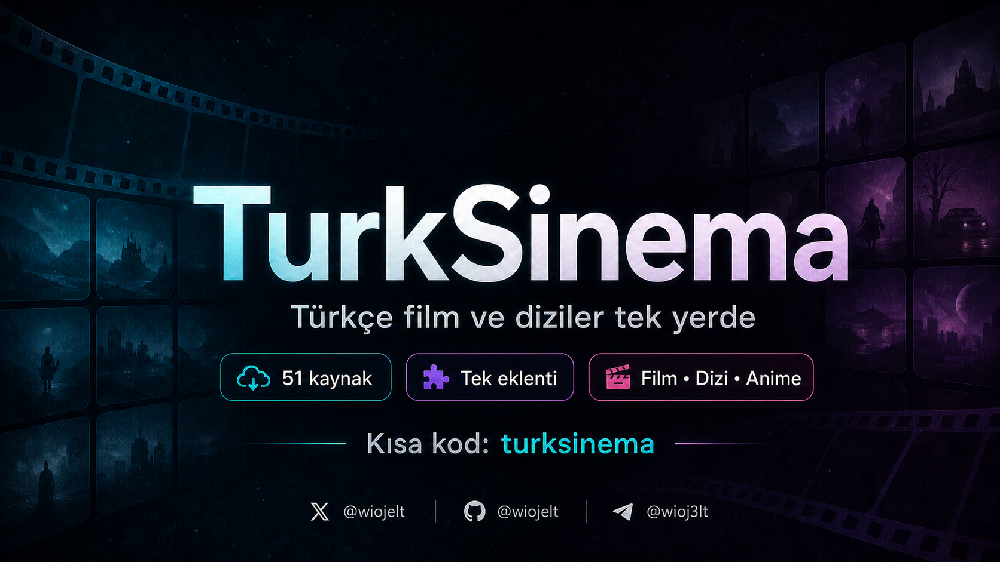

<p align="center">
  
</p>

<p align="center">
  
</p>

<p align="center">
  <a href="https://twitter.com/wiojelt"></a>
  <a href="https://kotlinlang.org/"></a>
</p>

<p align="center">
  <a href="https://buymeacoffee.com/wiojelt"></a><br>
  <a href="https://buymeacoffee.com/wiojelt">Bir kahveyle destek ol ☕</a>
</p>

<p align="center">
  <a href="https://twitter.com/wiojelt"></a>
  <a href="https://github.com/Wiojelt"></a>
  <a href="https://t.me/wioj3lt"></a>
</p>

<details>
<summary>⚖ DMCA</summary>

TurkSinema provides CloudStream extensions that retrieve links and playback information from third-party services. This repository does not host movies, series, or video files. Third-party content and trademarks belong to their respective owners. Copyright concerns about third-party content should be directed to its host; concerns about material in this repository can be reported through [Issues](https://github.com/Wiojelt/TurkSinema/issues).

TurkSinema, üçüncü taraf servislerden bağlantı ve oynatma bilgisi alan CloudStream eklentileri sunar. Bu depo film, dizi veya video dosyası barındırmaz. İçerikler ve markalar ilgili hak sahiplerine aittir. Üçüncü taraf içeriklere ilişkin telif bildirimleri içeriğin barındırıldığı hizmete; depodaki materyallerle ilgili bildirimler [Issues](https://github.com/Wiojelt/TurkSinema/issues) üzerinden iletilebilir.

</details>

## 📥 Kurulum

<p align="center">
  <a href="https://intradeus.github.io/http-protocol-redirector?r=cloudstreamrepo://raw.githubusercontent.com/Wiojelt/TurkSinema/main/repo.json">
    
  </a>
</p>

**Kısa kod: `turksinema`**

CloudStream → Ayarlar → Eklentiler → Depo ekle. Kısa kod açılmazsa tam adres:

```text
https://raw.githubusercontent.com/Wiojelt/TurkSinema/main/repo.json
```

Depo eklenmiyorsa [WARP](https://one.one.one.one/) ile tekrar deneyin.

<p align="center">
  <a href="PROVIDERS.md">51 sağlayıcı</a> · <a href="NOTICE.md">Atıflar</a> · <a href="LICENSE">GPL-3.0</a>
</p>
